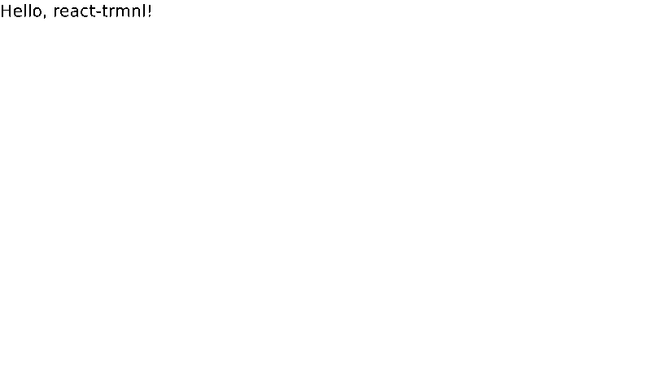
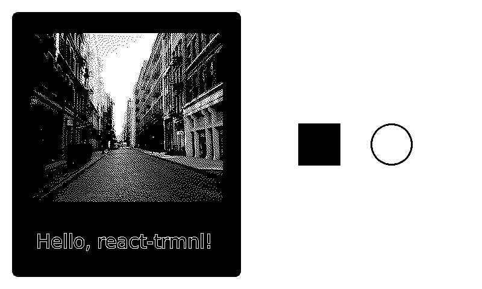

Build React apps for [TRMNL](https://usetrmnl.com) e-ink devices.

_Currently in development_

[](https://opensource.org/licenses/ISC)
[](https://www.npmjs.com/package/react-trmnl)
[](https://bundlephobia.com/package/react-trmnl)

What’s included:

- ⚙️ **Custom React Renderer**
  - Natively render React components to 1-bit monochrome images, no browser required
  - Generate, encode and serve 1-bit BMP or PNG images from Node.js to TRMNL devices
- 🎨 **Rendering Utilities**
  - Colors – Easily apply dithered colors and patterns to your components
  - Images – Choose from a variety of dithering algorithms to display 1-bit images
  - Fonts – Use bitmap fonts optimized for low-resolution, 1-bit screens
- ⚛️ **Component library** (coming soon) – A set of pre-built components for common UI patterns
- 🌐 **Development Server** (coming soon) – A browser-based TRMNL emulator for development and testing

## Getting started

Install both `react-trmnl` and `react` as dependencies in your Node project:

```bash
npm install react react-trmnl
```

Then, create a React component using building blocks from `react-trmnl`:

```tsx
// App.tsx
import { Trmnl, Text } from "react-trmnl";

export const App = () => (
  <Trmnl>
    <Text>Hello, react-trmnl!</Text>
  </Trmnl>
);
```

Finally, use the `render` function to render your component to a 1-bit image format:

```tsx
// index.tsx
import { render, ImageFormat } from "react-trmnl";
import { App } from "./App.js";

const png: Buffer = await render(<App />, ImageFormat.PNG);
```

**Resulting output**:



## Advanced styling example

```tsx
import React, { type ReactElement } from "react";
import { Trmnl, Box, Image, Text, Color, DefaultFont, Dithering } from "react-trmnl";

export const App = (): ReactElement => (
  <Trmnl style={{ flex: 1, flexDirection: "row", padding: 20 }}>
    <Box
      style={{
        flex: 1,
        alignItems: "center",
        justifyContent: "space-evenly",
        backgroundColor: Color.Black,
      }}
    >
      <Image
        src="https://picsum.photos/id/57/320/280"
        style={{ width: 320, height: 280, margin: 35, dithering: Dithering.Atkinson }}
      />
      <Text
        style={{
          height: 35,
          width: 300,
          margin: "auto",
          marginTop: 10,
          fontFamily: DefaultFont.Sans,
          borderColor: Color.White,
          borderWidth: 1,
          fontSize: 32,
        }}
      >
        Hello, react-trmnl!
      </Text>
    </Box>
    <Box
      style={{
        flex: 1,
        flexDirection: "row",
        alignItems: "center",
        justifyContent: "center",
        gap: 50,
        backgroundColor: Color.White,
      }}
    >
      <Box style={{ height: 70, width: 70, backgroundColor: Color.Black }} />
      <Box
        style={{
          height: 70,
          width: 70,
          backgroundColor: Color.White,
          borderColor: Color.Black,
          borderWidth: 3,
          borderRadius: 70,
        }}
      />
    </Box>
  </Trmnl>
);
```

**Resulting output:**



> [!TIP]
> For a complete example project, see the [example](./example) directory.

## How it works

TODO

## API

> [!WARNING]
> This project is in active development and is not yet ready for production use. Its API is not stable and may change frequently.

TODO

### Components

`<Trmnl>`

`<Box>`

`<Text>`

`<Image>`
