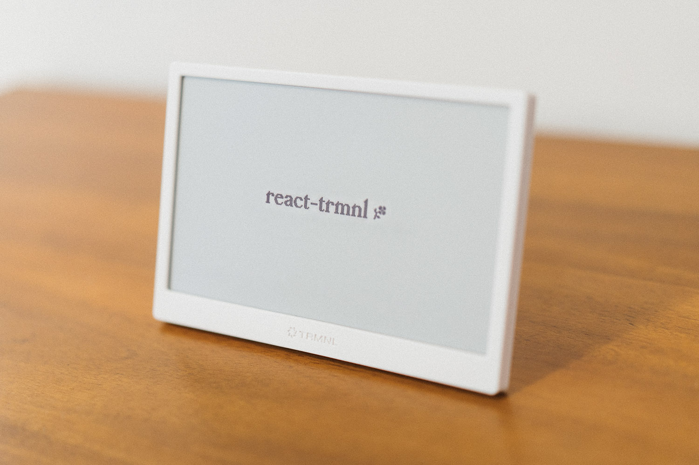

<br>

Build efficient, pixel-perfect server-side React apps for [TRMNL](https://usetrmnl.com) e-ink devices.

_Currently in development_



[](https://opensource.org/licenses/ISC)
[](https://www.npmjs.com/package/react-trmnl)
[](https://bundlephobia.com/package/react-trmnl)

<br>

`react-trmnl` is a Node.js library meant to be used as part of a [BYOS (Bring Your Own Server)](<(https://docs.usetrmnl.com/go/diy/byos)>) solution for TRMNL devices.

It includes:

- ⚙️ **A custom React renderer**
  - Natively render React components to 1-bit monochrome images, no browser required
  - Generate, encode and serve 1-bit BMP or PNG images from Node.js to TRMNL devices
- 🎨 **Rendering utilities**
  - Colors – Easily apply dithered colors and patterns to your components
  - Images – Choose from a variety of dithering algorithms to display 1-bit images
  - Fonts – Use bitmap fonts optimized for low-resolution, 1-bit screens (coming soon)
- ⚛️ **A component library** (coming soon) – A set of pre-built components for common UI patterns
- 🌐 **A development server** (coming soon) – A browser-based TRMNL emulator for development and testing

Inspired by [React Native](https://reactnative.dev/), [React ART](https://github.com/facebook/react/tree/main/packages/react-art) and [Ink](https://term.ink/).

<br>

## Getting started

Install both `react-trmnl` and `react` as dependencies in your Node project:

```bash
npm install react react-trmnl
```

Then, create a React component using building blocks from `react-trmnl`:

```tsx
// App.tsx

import { Trmnl, Text } from "react-trmnl";

export const App = () => (
  <Trmnl>
    <Text>Hello, react-trmnl!</Text>
  </Trmnl>
);
```

Finally, use the `render` function to render your component to a 1-bit image format:

```tsx
// index.tsx

import { render, ImageFormat } from "react-trmnl";
import { App } from "./App.js";

const png: Buffer = await render(<App />, ImageFormat.PNG);
```

**Resulting output**:


## Advanced styling example

```tsx
// App.tsx

import React, { type ReactElement } from "react";
import { Trmnl, Box, Image, Text, Color, DefaultFont, Dithering } from "react-trmnl";

export const App = (): ReactElement => (
  <Trmnl style={{ flex: 1, flexDirection: "row", padding: 20 }}>
    <Box
      style={{
        flex: 1,
        alignItems: "center",
        justifyContent: "space-evenly",
        backgroundColor: Color.Black,
      }}
    >
      <Image
        src="https://picsum.photos/id/57/320/280"
        style={{ width: 320, height: 280, margin: 35, dithering: Dithering.Atkinson }}
      />
      <Text
        style={{
          height: 35,
          width: 300,
          margin: "auto",
          marginTop: 10,
          fontFamily: DefaultFont.Sans,
          borderColor: Color.White,
          borderWidth: 1,
          fontSize: 32,
        }}
      >
        Hello, react-trmnl!
      </Text>
    </Box>
    <Box
      style={{
        flex: 1,
        flexDirection: "row",
        alignItems: "center",
        justifyContent: "center",
        gap: 50,
        backgroundColor: Color.White,
      }}
    >
      <Box style={{ height: 70, width: 70, backgroundColor: Color.Black }} />
      <Box
        style={{
          height: 70,
          width: 70,
          backgroundColor: Color.White,
          borderColor: Color.Black,
          borderWidth: 3,
          borderRadius: 70,
        }}
      />
    </Box>
  </Trmnl>
);
```

**Resulting output:**


> [!TIP]
> For a complete example project, see the [example](./example) directory.

## How it works

The implementation of `react-trmnl` is quite different from the official BYOS options offered by the TRMNL team.
Besides the fact [byos_sinatra](https://github.com/usetrmnl/byos_sinatra) and [byos_hanami](https://github.com/usetrmnl/byos_hanami) are written in Ruby, a major difference is that
these rely on a headless web browser (Puppeteer) to render the UI using HTML and CSS.

`react-trmnl` on the other hand doesn't rely on any browser, and uses a custom React renderer to paint React components directly to 1-bit images, bypassing the need for painting by a web browser.
This approach allows for a more efficient, faster and more reliable rendering process, which is also optimized for 1-bit monochrome screens.
High-performance native libraries such as `libvips` (bitmap rendering), `librsvg` (vector rendering) and `freetype` (font rendering) are used to handle low-level image processing tasks.

While this approach allows for much better performance and scalability, and tends to avoid [weird rendering synchronicity issues](https://www.reddit.com/r/trmnl/comments/1kenzsi/rendering_issue_today_on_several_plugins/) that can arise when using a headless browser, it does come with some limitations.
For example, the renderer doesn't deal with the DOM at all, so don't try using HTML elements like `div`'s. Much like with React Native, you'll need to use the native components provided by `react-trmnl` to build your UI.

Similarly, the renderer doesn't use CSS for styling, but rather a custom styling system that largely mimics CSS, using very similar properties and values. As such, you can use the same styling techniques you're used to with CSS.
UI layout is powered by [Yoga](https://www.yogalayout.dev/), the layout library used by React Native, which allows for a flexible and responsive layout system, including flexbox support.

`react-trmnl` therefore provides a familiar React API, but with a few differences and limitations compared to the developing React apps for the web, notably on the styling side. Supported styling properties are documented in the [API](#API) section below.

## API

> [!WARNING]
> This project is in active development and is not yet ready for production use. Its API is not stable and may change frequently.

TODO

### Components

`<Trmnl>`

`<Box>`

`<Text>`

`<Image>`
